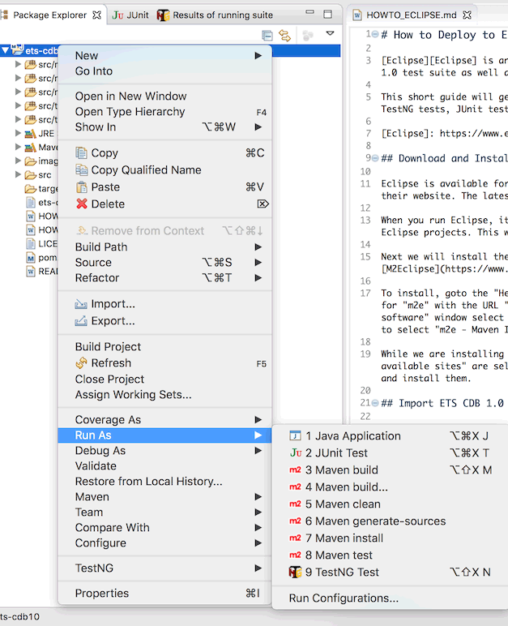
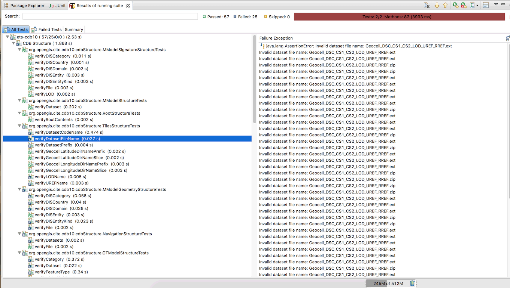
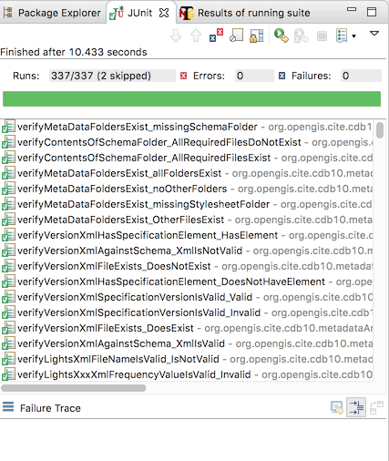

# How to Deploy to Eclipse IDE

[Eclipse][Eclipse] is an Integrated Development Environment for building applications and tools. It can be used to run the ETS CDB 1.0 test suite as well as develop and extend the test suite.

This short guide will get you set up with Eclipse and the ETS CDB 1.0 repository for Desktop development. You will be able to run TestNG tests, JUnit tests, and modify the test suites.

[Eclipse]: https://www.eclipse.org/ide/

## Download and Install Eclipse

Eclipse is available for Windows, MacOS, and Linux. If you do not already have it, download the latest version of the IDE from their website. The latest version as of this guide is "Oxygen".

When you run Eclipse, it may prompt you to create or select a workspace. If it asks, then create a new folder for storing your Eclipse projects. This will include the ETS CDB 1.0 in a moment.

Next we will install the Maven plugin for Eclipse, as the ETS CDB 1.0 test suite uses Maven for its compilation. We will use the [M2Eclipse](https://www.eclipse.org/m2e/) plugin as it works very well with Eclipse.

To install, goto the "Help" menu and select "Install new software". In the window, select the "Add" button and create a new entry for "m2e" with the URL "http://download.eclipse.org/technology/m2e/releases". Save the new repository, and back in the "Install new software" window select the "filter" field and type `m2e`. After a few seconds, some results will be shown and you will only need to select "m2e - Maven Integration for Eclipse". Follow the installation instructions.

While we are installing plugins, we will also install the TestNG plugin. Open the "Install new software" window and ensure "All available sites" are selected. In the filter field enter `TestNG`, and select the "TestNG" and "TestNG M2E Integration" packages, and install them.

## Import ETS CDB 1.0

Next we can set up a project for the test suite. From the "File" menu, select "Import". Under the "Maven" folder, select the "Check out Maven Projects from SCM" item.

For the SCM URL, use `https://github.com/opengeospatial/ets-cdb10`

Leave the rest of the options at their default values. Import the project. In the main Eclipse window, the Package Explorer in the left pane will now contain "ets-cdb10".



Try using Maven to build the project dependencies by right-clicking (or control-clicking) the project and going down to "Run As" and selecting "Maven Install". The Eclipse Console should automatically open and show the Maven install progress, which should complete in under a minute. 

## Run TestNG on included CDB

A sample CDB is included in the test suite for verifying the test methods. You can try running TestNG with Eclipse. From the "Run" menu, select "Run Configurations". In the left pane, a list of run and test types is listed. Right-click (or control-click) TestNG and select "New". In the configuration window, name it "CDB10 TestNG". Select the "Suite" radio button and click "Browse" to select a TestNG XML configuration file at `src/main/resources/org/opengis/cite/cdb10/testng.xml`. Leave the other tabs and settings at their default values. Click Apply to save the configuration, and then select "Run" to try TestNG.

A TestNG window may pop up with the results. If no results window is shown, goto the "Window" menu, "Show View", then "Other". In the pop-up window select "TestNG".

The results will show some failures, as the sample CDB included with the test suite contains some "dummy" directories that do not pass the conformance tests.

## Run TestNG on a custom CDB

If you have your own CDB that you would like to test with the test suite in Eclipse, you will need to create a new `testng.xml` file with the following contents:

```xml
<?xml version="1.0" encoding="UTF-8"?>
<!DOCTYPE suite SYSTEM "http://testng.org/testng-1.0.dtd">
<suite name="ets-cdb10" verbose="0" configfailurepolicy="continue">
  <parameter name="iut"  value="path/to/CDB" />
  <parameter name="ics"  value="1,2" />

  <listeners>
    <listener class-name="org.opengis.cite.cdb10.TestRunListener" />
    <listener class-name="org.opengis.cite.cdb10.SuiteFixtureListener" />
    <listener class-name="org.opengis.cite.cdb10.TestFailureListener" />
  </listeners>

  <test name="CDB Structure">
    <packages>
      <package name="org.opengis.cite.cdb10.cdbStructure" />
    </packages>
  </test>
  <test name="Metadata And Versioning">
    <packages>
      <package name="org.opengis.cite.cdb10.metadataAndVersioning" />
    </packages>
  </test>
</suite>

```

Change the `iut` to point to the directory of your CDB. The `ics` is "1" for conformance level 1, "2" for conformance level 2, and "1,2" for both conformance levels. Save the file anywhere, it does not need to be in the repository.

In Eclipse, open the Run Configuration window again and create a new TestNG configuration. For the Suite, select "Browse" and then "File System", and choose the `testng.xml` file you created. (It can actually be named anything you want, as long as its an XML file.)

The test results will then be shown in the TestNG results window. From here you can see which test methods passed and which methods failed, as well as jump to the test suite code to see how the failure was generated.



## Run JUnit Tests

This test suite contains JUnit tests for verifying the TestNG test methods. It may seem *odd* to test a test, but it is much easier to develop and verify a test method if you have a framework for setting up different test cases. JUnit does this by letting you set up a failure scenario and making sure the TestNG method correctly fails that scenario.

The JUnit tests are the same tests than Maven will run when compiling or packaging. You can run the JUnit tests inside Eclipse by selecting the project, going to the "Run" menu, to "Run As" and selecting "JUnit Test". You can open a JUnit results window similar to the TestNG results window, if you want to filter the passed/failed tests.


