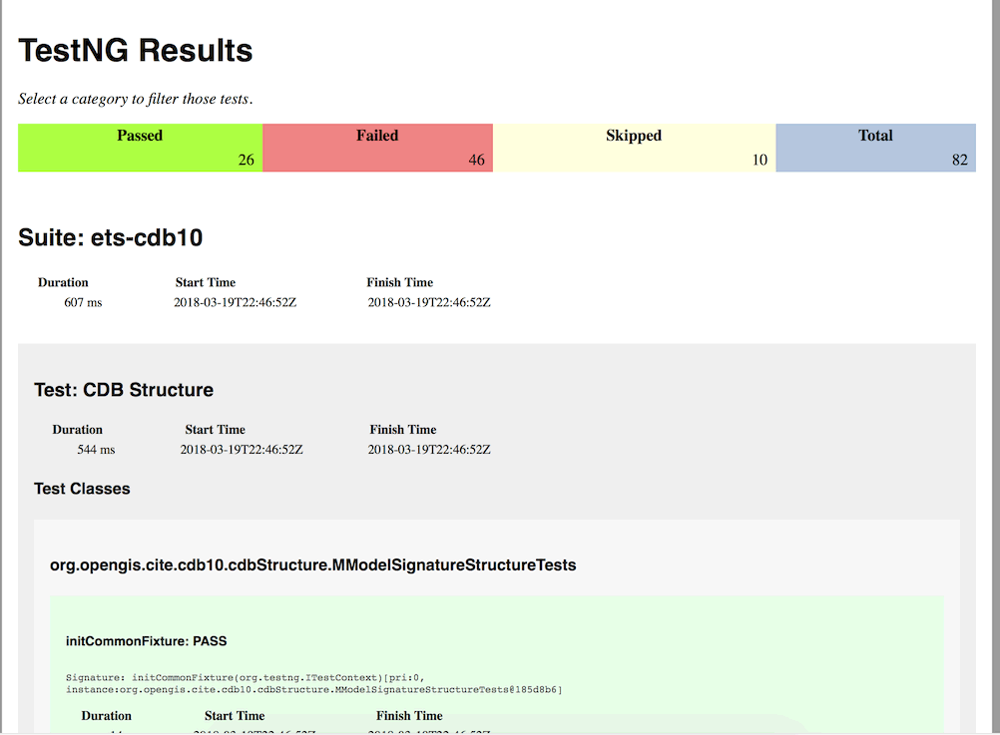

# How to Use as a JAR

The test suite can be deployed as a single JAR file, which allows you to test while installing minimal dependencies. Users who want to test CDBs with only needing a JVM should use the JAR command line interface. It is also the most secure option, if secure JAR deployment procedures are followed.

There are two steps. 

1. Build the JAR, which requires a Java Development Kit (JDK) and Maven 
2. Copy the JAR to the testing machine, which only requires a Java Virtual Machine (JVM)

The test output is TestNG formatted XML files.

## Building the JAR

You will need to install [Oracle JDK][Oracle Download Page] 7 or newer. Other JDKs such as [OpenJDK][OpenJDK] may work, but I have not tested it. JDKs are available for nearly every platform.

Once installed, you should be able to check your Java version from your console or terminal.

On MacOS/Linux:


```sh
$ java -verison
java version "1.8.0_73"
Java(TM) SE Runtime Environment (build 1.8.0_73-b02)
Java HotSpot(TM) 64-Bit Server VM (build 25.73-b02, mixed mode)
```

Or on Windows:

```
C:\Users\Me> java -version
java version "1.8.0_161"
Java(TM) SE Runtime Environment (build 1.8.0_16-b12)
Java HotSpot(TM) 64-Bit Server VM (build 25.161-b12, mixed mode)
```

Next we need to install [Maven][Maven Install], a tool for automating the building and set up of Java projects. Once installed, you should be able to access it on your console/terminal as the `mvn` command. Here is the version check output on MacOS.

```sh
$ mvn -version
Apache Maven 3.5.2 (138edd61fd100ec658bfa2d307c43b76940a5d7d; 2017-10-18T01:58:13-06:00)
Maven home: /usr/local/Cellar/maven/3.5.2/libexec
Java version: 1.8.0_73, vendor: Oracle Corporation
Java home: /Library/Java/JavaVirtualMachines/jdk1.8.0_73.jdk/Contents/Home/jre
Default locale: en_CA, platform encoding: UTF-8
OS name: "mac os x", version: "10.13.3", arch: "x86_64", family: "mac"
```

With those tools installed, download a ZIP version or use Git to clone the [ets-cdb10 repository from GitHub][ets-cdb10].

Use your console or terminal to open the repository on the command line, and use Maven to set up the project.

```sh
$ cd ets-cdb10
$ mvn install
```

This will take under a minute and will do a few things to compile the test suite. It will run the JUnit test suite to check for any broken code in the TestNG test suite. It will compile the documentation into a website for deployment on GitHub/TEAM Engine. It will build ZIP and JAR archive files for the tool and TEAM Engine.

The only file we will need is in the `target` folder, and it is called `ets-cdb10-0.2-SNAPSHOT-aio.jar`. This is the all-in-one file that contains everything the test suite needs to run independently. This file can be deployed to other machines and used to test a CDB.

[Oracle Download Page]: http://www.oracle.com/technetwork/java/javase/downloads/index.html
[OpenJDK]: http://openjdk.java.net
[Maven Install]: http://maven.apache.org/install.html
[ets-cdb10]: https://github.com/openfirmware/ets-cdb10

## Using the JAR

On the machine you want to test a CDB, you will need to install a Java Virtual Machine to run the all-in-one file. If you already have installed a Java Development Kit then you do not need to also install a JVM. You can [download a JVM from Oracle][Oracle Download Page].

To test the CDB, we need to create a test run properties file that the all-in-one file will read and use to find the CDB. Create a new XML file with the following contents:

```xml
<?xml version="1.0" encoding="UTF-8"?>
<!DOCTYPE properties SYSTEM "http://java.sun.com/dtd/properties.dtd">
<properties version="1.0">
    <comment>Sample test run arguments</comment>
    <entry key="iut">/path/to/CDB</entry>
    <entry key="ics">1,2</entry>
</properties>
```

On Windows, you will need to change `/path/to/CDB` to the Windows path to the root of the CDB (NOT the directory above the CDB), and Windows users should use Windows path format (e.g. `C:\Databases\CDB`).

Users on MacOS or Linux can use UNIX path style to reference the CDB. It *might* be possible to reference a CDB on a network drive or mount, although I have not tested it.

In the XML file you can change the "1,2" for the ICS to either "1", "2", or "1,2" to specify which conformance levels you want to test. The default "1,2" is recommended.

Save the file as an XML file with a descriptive name referring to the CDB it points to.

Now we can use the all-in-one file to test the CDB.

```sh
$ java -jar ets-cdb10-0.2-SNAPSHOT-aio.jar path/to/properties.xml
```

This will launch the test suite without a graphical user interface and generate the test results, usually in a few seconds for small CDBs.

A directory named `testng` will be created in your home directory with the test results. On Windows, that will be in `C:\Users\You\testng` (or elsewhere if you have changed your default user setup). On MacOS, that will be in `/Users/you/testng`. On Linux, that will be in `/home/you/testng`.

Inside the `testng` directory a sub-folder with a UUID name will be created each time the test suite is ran. That UUID directory will contain an XML file with the test results.

If you are not familiar with XML, the test results file will be difficult to read. The very first line will give a basic overview:

```xml
<testng-results skipped="10" failed="46" total="82" passed="26">
```

I created a tool that can [convert these XML files into simple HTML files][testng2html] that you can view in your web browser. There is also a more well-developed tool for doing this called [ReportNG][ReportNG], although it is no longer updated.

[testng2html]: https://github.com/openfirmware/testng2html
[ReportNG]: https://reportng.uncommons.org


